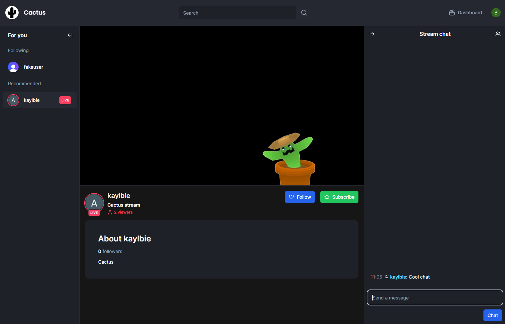

# Cactus Streaming Platform

## Overview

Cactus is a powerful streaming platform built on **Next.js 14**. It integrates key technologies to provide a seamless experience for developers and users alike. With LiveKit and Clerk APIs, as well as MySQL for data management, it serves as an efficient and robust foundation for your streaming needs.

## Getting Started

### Prerequisites

To get started, ensure you have the following requirements:

- **MySQL Server**  
  - For data management

- **LiveKit API Keys**  
  - Used for real-time audio and video features

- **Clerk API Keys**  
  - For user authentication and management

- **Webhook Links**  
  - Configure webhook links for LiveKit and Clerk

### Database Setup

After obtaining the necessary API keys and setting up your database server, run the following commands to generate and push your Prisma schema to the MySQL database:

```bash
npm prisma generate
npm prisma db push
npm run dev
# or
yarn dev
# or
pnpm dev
# or
bun dev
```


### Stream Page

